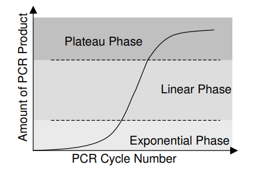

How the Double Delta Ct Method Works
================
Riley M. Anderson
February 06, 2024

  

- [Overview](#overview)
- [How the
  
  method works:](#how-the-2-delta-delta-ct-method-works)
- [A working example](#a-working-example)
  - [Proper reference gene:](#proper-reference-gene)
  - [Now, a bad reference gene:](#now-a-bad-reference-gene)
- [Session Information](#session-information)

## Overview

## How the  method works:

Expression of the gene of interest is measured and calibrated to a
reference gene.

The

is the normalized difference in gene expression between a gene of
interest in control and treatment conditions:

where,

_{ref.gene}")

and

_{target.gene}")

Visually, this table represents the data needed:

|                | Control | Treatment |
|:---------------|:--------|:----------|
| Reference gene | A       | B         |
| Target gene    | C       | D         |

Where the above formula becomes:

 - (C - D)")

Alternatively,

 - (C - A)")

Or if you prefer no parentheses:

The above 3 equations are equivalent (this can be useful if your data
are organized in different ways).

To understand the intuition behind this method we first need to
understand what a Ct, or cycle threshold value actually is.

<figure>

<figcaption aria-hidden="true">Yuan et al. 2006 Fig. 1</figcaption>
</figure>

PCR has three phases, an exponential phase, a linear phase, and a
plateau phase. PCR product will essentially double with each cycle in
the *exponential* phase as reagents are not limited. As reagents become
limiting, PCR product will be produced *linearly* with cycle number
until some reagents are fully depleted, at which time the PCR product
will no longer increase with cycle number, defining the *plateau* phase.

Plotting the PCR product with

transformation will yield a range where PCR product correlates with the
original template amount.

<figure>

<figcaption aria-hidden="true">Yuan et al. 2006 Fig. 2</figcaption>
</figure>

The peak of this range is the transition from the exponential phase to
the linear phase which defines the cycle threshold number.

- Comparing two samples, a higher Ct value means lower expression since
  it took more PCR cycles to reach the same threshold value of PCR
  product.

In order for relative quantification of gene expression to be valid, the
chosen reference gene needs to have stable expression across treatment
conditions.

That is

where the expression of the reference gene should only marginally
fluctuate across samples and treatments.

- If
  
  then,

- A positive
  
  will result in upregulation:

} \to FC>1")

alternatively,

- A negative
  
  will result in downregulation:

} \to FC<1")

## A working example

**Downregulation** is defined by a **higher** Ct value in the treatment
condition compared to the control condition. Let’s try the calculations
with ideal data and with data that have a poor reference gene.

### Proper reference gene:

|                | Control | Treatment |
|:---------------|--------:|----------:|
| Reference gene |  26.012 |    26.475 |
| Target gene    |  24.149 |    26.688 |

Our

= A - B

    ## [1] -0.463

Not bad, pretty close to 0

Our

= C - D

    ## [1] -2.539

Ok, this indicates that our target gene is **downregulated** in the
treatment condition.

\<- (A - B) - (C - D)

    ## [1] 2.076

Notice that the

value is **positive**.

Now for the fold change transformation:
}")
or
}")

    ## [1] 0.2371711

Our answer falls between 0 and 1 indicating that the target gene is
**downregulated**. This result makes sense given the negative

value.

### Now, a bad reference gene:

This example will use the same values as above for the target gene. Only
the reference gene has changed.

|                | Control | Treatment |
|:---------------|--------:|----------:|
| Reference gene |  21.903 |    26.475 |
| Target gene    |  24.149 |    26.688 |

Our

= a - b

    ## [1] -4.572

Terrible, our reference gene is not stable.

Our

= c - d

    ## [1] -2.539

Again, this would indicate that our target gene is **downregulated** in
the treatment condition.

\<- (a - b) - (c - d)

    ## [1] -2.033

Notice that our

value is now **negative**!

Now for the fold change transformation:
}")
or
}")

    ## [1] 4.09255

Now our answer is much greater than 1 indicating that the target gene is
highly **upregulated**! Even slight differences in expression of the
reference gene can generate spurious results! Here the direction of the
effect is completely reversed and our interpretation of the result would
be meaningless.

## Session Information

    R version 4.2.3 (2023-03-15 ucrt)
    Platform: x86_64-w64-mingw32/x64 (64-bit)
    Running under: Windows 10 x64 (build 19045)

    Matrix products: default

    locale:
    [1] LC_COLLATE=English_United States.utf8 
    [2] LC_CTYPE=English_United States.utf8   
    [3] LC_MONETARY=English_United States.utf8
    [4] LC_NUMERIC=C                          
    [5] LC_TIME=English_United States.utf8    

    attached base packages:
    [1] stats     graphics  grDevices utils     datasets  methods   base     

    other attached packages:
    [1] knitr_1.42

    loaded via a namespace (and not attached):
     [1] compiler_4.2.3   fastmap_1.1.1    rprojroot_2.0.3  cli_3.6.1       
     [5] tools_4.2.3      htmltools_0.5.5  rstudioapi_0.14  yaml_2.3.7      
     [9] codetools_0.2-19 rmarkdown_2.21   xfun_0.38        digest_0.6.31   
    [13] rlang_1.1.0      evaluate_0.20   
